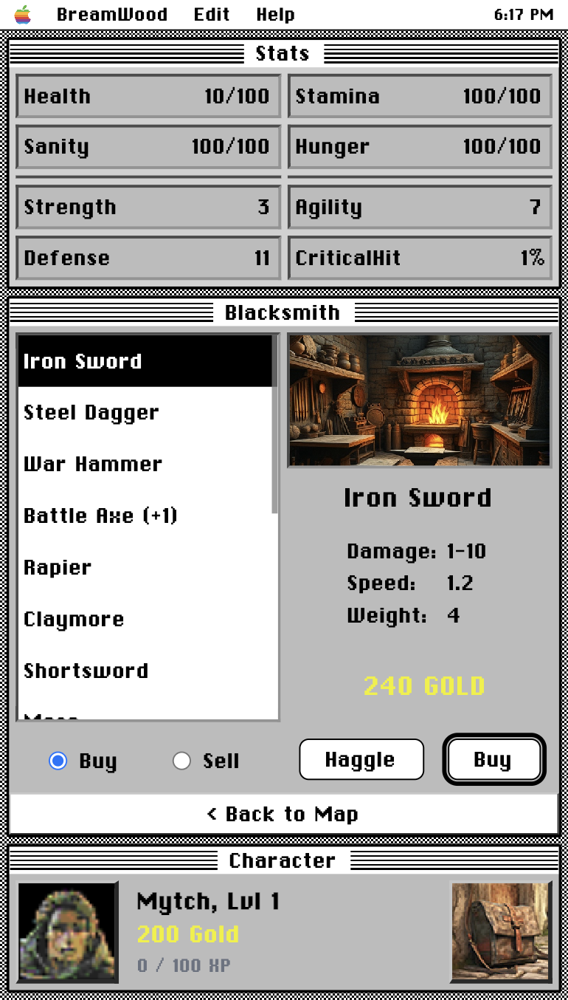

# BreamWood

A free open-source Vue.js RPG game based on the early Macintosh System 7 games.

See a hosted version at: <https://tools.mytchall.dev/breamwood/>

## Installation

Make sure Node >v20 is installed on your system.

Open this folder in your terminal and run:

- `npm i` to intall dependencies.
- `npm run dev` to run dev server.

## Development

Vue.js, Pinia and Tailwind are used.

To get to v1, this list needs to be complete:

### UX

[x] - Build basic UI components

[x] - Get New Game working

[ ] - Get Save/Quit working (currently uses localstorage)

### Screens

[x] - Build Blacksmith screen
[ ] - Get Blacksmith features working

[ ] - Build Armorer screen
[ ] - Build Inn screen
[ ] - Build Arena screen
[ ] - Build Market screen
[ ] - Build Castle screen
[ ] - Build Dunegon screen

### State

[x] - Create item inventory structure
[ ] - Show items in modals

## Contributing

If you want to submit a pull request, make sure commits are small and readable `:)`
